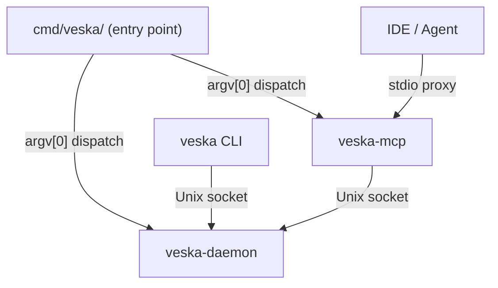
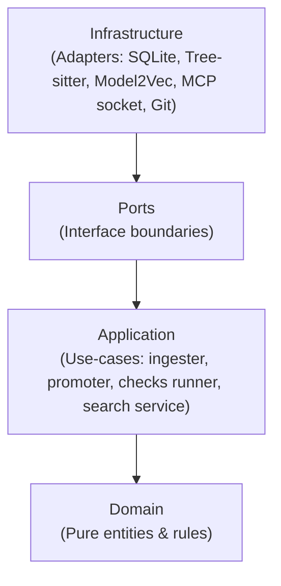

# Veska Architecture

Veska is a local-first code-intelligence daemon designed to serve structural and semantic graph representations of your codebase to editor integrations and AI agents via the Model Context Protocol (MCP).

---

## 1. Design Philosophy & Scope

* **Single-User, Single-Daemon, Local-First:** Veska runs entirely on the developer's machine. All state, parsing, and vector indexing live under `~/.veska/`. No upstream, cloud database, or remote daemon is required.
* **YAGNI by Default:** Abstractions are built for what exists today. There are no placeholder interfaces for hypothetical cloud or team deployments.
* **Observe Before Budgeting:** Performance characteristics (parsing speeds, embedding latency, write contention) are explicitly measured and documented.

---

## 2. Process Topology: One Binary, Three Personalities

The build produces a single compiled binary at `bin/veska` with symlinks directing process dispatch into three distinct execution modes:

1. **`veska` (CLI):** The developer's operator and management surface. Used to initialize the configuration (`veska init`), register repositories (`veska repo add`), manually trigger diagnostic checks (`veska doctor`), and generate output wiki sites (`veska wiki`).
2. **`veska-daemon`:** The persistent background coordinator. It runs as a system service, monitors filesystem changes via file watchers, hosts the local SQLite database, and handles CPU-bound semantic embedding computations in-process.
3. **`veska-mcp`:** A thin, lightweight stdio shim designed to register as an MCP server with IDEs (e.g. Cursor, Zed, Claude Desktop). It acts as a transparent proxy, forwarding JSON-RPC requests over a local Unix socket to the active daemon process.

---

## 3. Storage Substrate

Veska isolates its database and index models into two storage schemas under `~/.veska/`:

* **Relational Storage (SQLite):** Used for structural metadata. SQLite acts as the primary data store for the code graph (nodes, edges), active repositories, audit logs, file indices, and findings/suppressions. 
* **Vector Index (memvec / usearch):** Used for semantic search. Veska elects a single embedding model at boot (Model2Vec/potion-code-16M by default). Vectors are stored separately and retrieved via either a linear in-process scan (`memory`) or an HNSW index (`usearch`).

---

## 4. Hexagonal Architecture Structure

Veska is organized cleanly into domain-driven hexagonal layers:

### Domain (`internal/core/domain/`)
Contains pure entities and logic invariants entirely free of external dependencies. Defines core types:
* `Node` & `Edge`: The components of the structural code graph.
* `Finding` & `Suppression`: The artifacts representing advisory warnings (e.g., dead code, secrets, vulnerabilities).

### Ports (`internal/core/ports/`)
Defines interface contracts that decouple the application core from specific implementation technologies:
* `GraphStorage`: Defines how nodes and edges are promoted and retrieved.
* `VectorStorage`: Defines the vector insertion and semantic nearest-neighbor search contract.
* `VulnSource`: Defines the vulnerability scanning query interface.

### Application (`internal/application/`)
Implements orchestration logic and coordinates transactions across ports:
* **Ingester:** Handles parsing filesystem updates into the graph.
* **Promoter:** Manages the integration of staged code graphs upon new commits.
* **Checks Runner:** Executes advisory pipelines (secrets, vuln scanners, dead code detection).

### Infrastructure (`internal/infrastructure/`)
Contains concrete technology adapters that implement the Ports:
* `sqlite/`: SQLite adapters for graph storage, task queues, and metadata databases.
* `treesitter/`: Parses `.go` source code files into AST nodes and resolves lexical symbols.
* `embedding/`: Adapters for Model2Vec, static-v2, and Ollama embedding providers.

---

## 5. Freshness Clocks: Save vs. Promotion

The code graph stays synchronized using two distinct timelines:

1. **Save-Time Pipeline (Staging):** Driven by filesystem watcher events on file save. Reparses the modified files and writes them to a temporary **staging table** in SQLite. This ensures instant structural autocomplete/reference lookups during active development.
2. **Promotion-Time Pipeline (Commit):** Triggered by the Git `post-commit` hook (or via `eng_promote_repo`). Merges the staging graph into the main production tables, runs background checks (secret scanning, dead-code analysis, vulnerability audits), and recalculates semantic vector embeddings for the affected codebase files.
