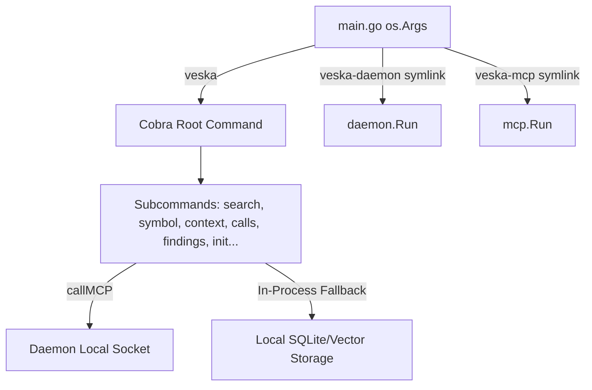

# Veska CLI (`cmd/veska`) Comprehensive Code Review

This document provides an in-depth architectural and code review of the `cmd/veska` command-line interface. The review details the design system, daemon proxying patterns, user experience safeguards, and provides technical diagnoses for outstanding open issues.

---

## 🏛️ Architectural Overview & Core Patterns

The `cmd/veska` package implements the unified entry point for Veska. Rather than maintaining multiple binaries, all entry points (`veska`, `veska-daemon`, `veska-mcp`) are consolidated into a single Go package using `cobra`.



### 1. argv[0] Dispatcher (`main.go`)
- **Mechanism**: The CLI uses `filepath.Base(os.Args[0])` to detect if it was invoked through the `veska-daemon` or `veska-mcp` symlink. If so, it routes execution directly into the background packages, bypassing the Cobra command parser.
- **Structured Logs Control**: To keep CLI output clean for standard unix composition (pipes, redirects), the text handler is silenced via `slog.SetDefault(slog.New(slog.NewTextHandler(io.Discard, nil)))`. Subcommands like `veska search` that trigger in-process cold scans will not spill background ingester/embedder logs onto `stderr`.

### 2. The Daemon/In-Process Hybrid Pattern
Many commands exhibit a dual-execution mode:
- **Daemon-First**: If a background daemon is running, commands communicate via `callMCP` (JSON-RPC stdio transport over the local Unix domain socket). This ensures all state queries execute on the unified database cache and share the daemon's hybrid lexical + semantic retrieval pipeline.
- **In-Process Fallback**: If the daemon is unreachable (or the command runs inside a first-run/ephemeral context, such as `search <query> <git-url>`), the CLI spins up local database pools (`sqlite.OpenPools`), instantiates the parsing/embedding engines in-process, drains the queues, and resolves the query locally.

### 3. Smart Workspace Scoping (`symbol.go`, `search.go`)
- **Auto-Resolution**: When a command is run without the `--repo` flag, `resolveRepoFromCWD` queries `eng_get_current_repo` using the caller's working directory. 
- **User Breadcrumbs**: In multi-repo environments, `autoResolveRepo` emits a stderr banner (`veska: scoped to repo <id>`) to eliminate the silent scoping confusion that occurred on initial developer tests.

---

## 📂 Component Deep Dive

### 🔍 `search.go` (Semantic Retrieval)
- **Synchronous Cloning**: `ephemeralEnsureFromURL` implements the remote search cache tier. It clones remote repositories to `~/.cache/veska/repos/<id>` with `--depth=1`, registers them, marks them `ephemeral`, indexes them, and queries them.
- **Prettified Paths**: For ephemeral queries, absolute paths are translated to a readable format (e.g. `pflag/flag.go` instead of the 64-char hex cache prefix).
- **RRF Calibration Alert**: Scores represent fused Rank Reciprocal Fusion. Absolute RRF scores below `0.018` trigger a `weakTopAbsolute` note warning that the query has low-confidence hits.

### 🕸️ `symbol.go` & `graph.go` (Navigation & Call Chains)
- **Fuzzy Fallbacks**: Unqualified symbol queries (e.g., `veska symbol Run`) are fanned out. If the local search yields nothing but matches exist in other registered repositories, `printCrossRepoSymbolHint` suggests alternative scopes.
- **Cross-Repo Edges Resolution**: Opaque hex hashes returned by the MCP layer are translated back to human-scannable identifiers (`formatCrossRepoNode`) by looking up the nodes using `resolveCrossRepoNode`.

### 🐛 `findings.go` & `findings_suppress.go` (Audit & Quality Gates)
- **Noise Control**: Auto-link rule alerts can flood projects. The CLI implements curated default filters (`--include-low` defaults to `false`) to keep output action-oriented for CLI users while leaving the raw MCP payloads intact.
- **Granular Actions**: Users can run `close` and `suppress` directly, which tracks resolved/accepted findings and records an auditable justification.

---

## 🎯 Technical Diagnosis of Active Walkthrough Issues

The `bd ready` list currently highlights several unresolved usability and correctness issues. The following section provides the exact code paths and diagnoses for these bugs.

### 1. `solov2-izh6.25`: `findings list: FILE column blank; 'showing 1' prints zero rows by default`
> [!IMPORTANT]
> **Diagnosis - Row Hiding Conflict:**
> In `findings.go` (lines 172-192), `summariseFindings` is printed *before* the low-severity findings are filtered out:
> ```go
> counts := countSeverities(resp.Findings)
> fmt.Fprintln(w, summariseFindings(len(resp.Findings), counts, resp.Findings)) // "showing 1 finding(s)"
> ...
> if !includeLow && severity == "" {
>     // Filters out low findings, making shown empty!
> }
> ```
> If the only findings present are low-severity (e.g. `auto-link`), they are filtered out after the header has already claimed to show them, resulting in the contradictory output:
> ```
> showing 1 finding(s): 1 low (auto-link)
>   (1 low-severity hidden; pass --include-low to show)
> [No rows printed]
> ```
> **Diagnosis - File Column Blank:**
> In the table formatter (lines 208-225), the column writes `path` directly, which is mapped from `*f.FilePath`. If the scanner returns a `nil` or empty `file_path` in JSON (which happens when findings are repo-wide, package-level, or unmapped dependencies), `path` stays `""` rendering the column blank. It should fallback to a repo-root representation or `<repo>` placeholder when the path is not localized to a single file.

### 2. `solov2-izh6.31`: `Cross-repo CALLS edges lose call-site line metadata`
> [!WARNING]
> **Diagnosis - Declaration vs Call-Site Line:**
> In `symbol.go` (line 301), `resolveCrossRepoNode` queries `eng_get_node` which extracts node metadata from the database:
> ```go
> n := resp.Nodes[0]
> return crossRepoNodeInfo{Name: n.Name, Kind: n.Kind, FilePath: n.FilePath, Line: n.LineStart}
> ```
> Because `eng_get_node` queries the *target* node definition, `LineStart` returns the declaration line of the function/method (e.g. `main.go:77` for `func main()`), **not** the line of the actual call-site making the call. 
> To fix this, the call-site line number needs to be extracted from the *edge* metadata (i.e. inside the edge payload returned by `eng_get_call_chain` / `eng_get_context_pack` stub mappings) and passed down during rendering rather than trying to reconstruct it solely from the node's definition table.

### 3. `solov2-izh6.27`: `Cold-scan visibility lag: freshly-committed symbols unqueryable for ~7s`
> [!TIP]
> **Diagnosis - Async Embedder Promotion Lag:**
> When code changes are detected or a reindex is triggered, the ingestion parses ASTs and registers new nodes immediately. However, the vector database requires semantic embeddings.
> In `drainEmbedderQueue` (lines 430-449), the tick sleep is 250ms, but the daemon's background sync interval and Sqlite transaction commits introduce a delay. If the index promoter runs on a separate sync sweep, freshly-indexed symbols are present in the SQL graph but lack vector embeddings, causing them to be unqueryable for several seconds until both pipelines align.

### 4. `solov2-izh6.30`: `eng_find_symbol returns empty silently during cold-scan; no degraded_reasons hint`
> [!NOTE]
> **Diagnosis - Missing Degraded Reasons in Symbol Lookups:**
> Unlike `search` and `calls` commands which bubble up `degraded_reasons` (`embeddings_pending`, `chained_selectors_unresolved`), `eng_find_symbol` does not return active scanning state info on empty results. 
> In `symbol.go` (lines 110-125), `resp.Nodes` is empty and no degraded hint is provided to tell the user that an active scan is still processing files in the background.

---

## 🛠️ Security and Robustness Audit

Following the **Secure Coding Guidelines**:

1. **Network Egress Limits**: `init.go` implements strict opt-in prompts (`resolveVulnChoice`) before enabling network-bound OSV scanning. By default, CI and non-interactive environments won't execute network calls unless `-y` is explicitly supplied or `--no-vuln` is omitted.
2. **Command Injection Risks**: Symlinks and service installers (`service.go`, `install.go`) invoke system binaries. These execute via explicit argument arrays (`exec.Command(args[0], args[1:]...)`) and never interpolate shell variables, neutralizing execution injection vectors.
3. **Database Concurrency Safety**: The hybrid pattern prevents CLI commands from opening active SQLite writing pools while the daemon holds exclusive locks on `veska.db` by defaulting all commands to MCP-over-socket communication.

---

## 📈 Quality & Testing Recommendations

### Actionable Fixes to Improve the CLI Suite:
1. **Fix FTS5 Test Failures**: Several CLI tests fail with `no such module: fts5`. This is caused by the test suite running against a standard `sqlite3` driver that lacks the full-text search extensions. The build pipeline and tests should explicitly build with the `sqlite_fts5` tag or bundle a precompiled static binary.
2. **Harmonize Output Options**: Ensure all graph tools (`context`, `calls`, `blast`) accept identical scoping arguments and output structures. `changed` and `deps` commands should consistently support `--json` and `--repo` flags with matching schemas.

---

## 🧹 Code Quality, Layout & Structural Recommendations

Beyond specific bug fixes, the `cmd/veska` package can benefit from structural refactoring to align with Go clean code and architecture best practices:

### 1. Flat Folder Layout & Directory Bloat
* **Observation**: Direct navigation of the 53 files in `cmd/veska` is cumbersome. Interleaved test files and subcommand definitions complicate developer comprehension.
* **Recommendations**:
  - Keep the command bootstrap `main.go` and `root.go` lightweight.
  - Consolidate logically related command family files under sub-packages (e.g. `cmd/veska/findings/` for findings command logic, suppressions, and suppressions tests).
  - Alternatively, move command definitions to `internal/cli/commands/` and keep `cmd/veska` purely as a thin package import wrapper.

### 2. High Coupling & Leaky Abstractions
* **Observation**: Several CLI commands (particularly `search.go`) boot heavy application services directly in-process. They manage SQLite pools, configure background workers (`embedder.NewWorker`), and access low-level vector storages.
* **Recommendations**:
  - Encapsulate all in-process/offline fallback operations within a dedicated service layer (e.g., `internal/application/offline`).
  - The CLI commands should remain strictly presentation-oriented: parsing flags, dialing the Daemon service via MCP, or calling the single offline service wrapper when running local offline scans.

### 3. Redundancy & Shared UI Helper Fragmentation
* **Observation**: UI output formatting and terminal-handling helpers are duplicated or declared ad-hoc in multiple files.
  - E.g., `shortID(id string)` in `symbol.go` and `shortIDOf(repoID string)` in `search.go` perform identical 12-char hex truncations under different names.
  - `looksLikeNodeID(s string)` and other string checks are scattered across `graph.go` and `symbol.go`.
* **Recommendations**:
  - Centralize terminal rendering, ID shorteners, string formatters, and TTY/interactive prompts into a single utility file (e.g., `cmd/veska/ui.go` or `cmd/veska/terminal_helpers.go`).
  - This guarantees consistent formatting across commands and simplifies maintenance when modifying the terminal theme/output styling.

### 4. Direct References to OS Streams
* **Observation**: While many commands use Cobra's dynamic `cmd.OutOrStdout()` and `cmd.ErrOrStderr()`, some methods directly reference `os.Stdout`, `os.Stderr`, or hardcode stream writers.
* **Recommendations**:
  - Audit all CLI commands to systematically replace any direct references to `os.Stdout`/`os.Stderr` with Cobra-controlled stream writers.
  - Passing `cmd.OutOrStdout()` down to sub-methods ensures stream output can be captured cleanly and reliably in parallel unit tests.

